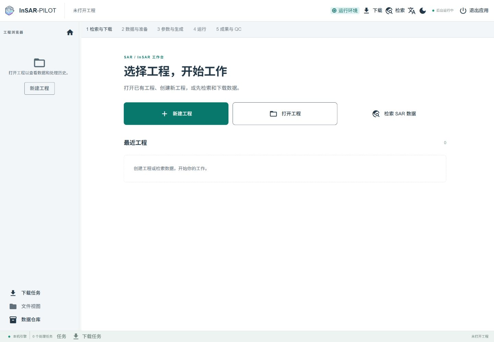

<h1 align="center">让雷达影像工作，更有条理。</h1>

从研究区域出发，在一个工作台里寻找影像、管理下载、组织工程。

本机运行 · 浏览器使用 · 中英双语 · 开源免费

<a href="https://github.com/WU-Pengzhan/InSAR-PILOT/releases/tag/v1.5.0">获取 1.5.0</a> · <a href="docs/quickstart.md">快速开始</a> · <a href="https://wu-pengzhan.github.io/InSAR-PILOT/">使用文档</a> · <a href="README_EN.md">English</a>

---

## 你的 SAR / InSAR 工作台

InSAR-PILOT 面向使用雷达影像开展研究的用户，把工程、地图、影像清单和后台任务放在同一个清晰的界面里。你可以先探索数据，也可以从一个已有工程继续工作，让影像找到归属，让任务进度随时可见。

**1.5.0 聚焦 Sentinel-1 的工程管理与检索下载体验。** 后续将逐步完善数据准备、参数配置、运行监控和成果查看。

## 从地图找到需要的影像

在地图上圈定研究区域，结合日期、卫星、轨道和极化等条件缩小范围。影像覆盖与结果清单放在一起，便于判断哪些场景值得保留。

- **按研究区域查找**：支持地图绘制范围，也可输入范围或使用已有区域文件。
- **灵活筛选 Sentinel-1**：A、B、C、D 卫星可分别选择，按研究需要组合条件。
- **边查边选**：已选影像独立保留，继续调整检索条件时不用重新挑选。
- **确认后再下载**：预览影像、附属数据和保存位置，再决定创建工程、加入工程或仅下载。

## 每个研究，从一个清晰的工程开始

打开工作台，可以新建工程、打开已有工程，或直接进入数据检索。最近工程帮助你快速返回手头的研究，侧边工程浏览器让数据与工作内容始终可找到。

工程内的数据、处理过程和成果分区管理；共享数据仓库支持已经获取的数据再次使用。关闭工程后，后台下载仍会继续。

## 下载有进度，也有来处

从提交到完成，在下载中心查看每个批次的状态、影像清单与实际保存位置。需要中断时可以暂停或取消，后续继续或重试也有入口，历史尝试保留可查。

- 按场景、批次或路径查找任务，分页查看历史。
- 按需获取轨道文件与覆盖整景范围的高程数据。
- 切换工程、离开页面或关闭浏览器，后台任务仍独立运行。

## 适合持续工作的界面

**中英双语与明暗主题**，适应不同阅读习惯。可调整的工程栏、可收起的属性面板，把更多空间留给地图和当前任务。

在 Ubuntu 上使用，或让 Windows 浏览器连接 WSL 中的工作台。同一时刻一个窗口进入工作区，其他窗口自动等待；关闭当前窗口后，等待页自动接续。

## 一条逐步完善的研究流程

| 工作环节 | 1.5.0 中的状态 |
| --- | --- |
| 检索与下载 | 已提供地图检索、影像选择、获取预览和下载管理 |
| 数据与准备 | 已有基础输入能力，完整页面待完善 |
| 参数与生成 | 已有底层能力，专业参数页面待完善 |
| 运行 | 已有任务、日志与历史基础，完整流程交互待完善 |
| 成果与 QC | 已有基础成果能力，专业浏览与检查页面待完善 |

当前版本优先服务 Sentinel-1；NISAR 现有后端能力保留，专属体验后续推进。真实账号长时下载和完整科学流程仍有独立验收事项，详见[版本说明](docs/releases/1.5.0.md)。

## 开始使用

从 [GitHub Releases](https://github.com/WU-Pengzhan/InSAR-PILOT/releases/tag/v1.5.0) 获取版本，按[安装指南](docs/installation.md)完成本机安装，再跟随[快速开始](docs/quickstart.md)探索第一个研究区域。

需要帮助或有功能建议？欢迎提交 [Issue](https://github.com/WU-Pengzhan/InSAR-PILOT/issues)。开发与贡献请阅读 [CONTRIBUTING](CONTRIBUTING.md)。

## 开源与致谢

InSAR-PILOT 使用 [Apache-2.0](LICENSE) 许可证。感谢 [ISCE2](https://github.com/isce-framework/isce2)、[ISCE3](https://github.com/isce-framework/isce3) 与 ASF 等开源项目和数据服务对雷达研究的支持。本项目为独立工作台，不是这些机构的官方产品。
