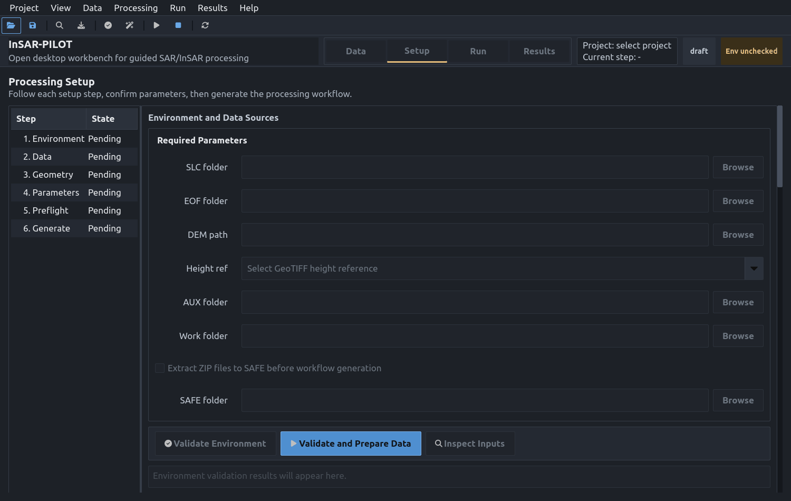

# InSAR-PILOT

<p align="center">
  
</p>

**InSAR-PILOT** stands for **InSAR Processing Interface and Lightweight Orchestration Toolkit**.

**Subtitle: Open Desktop Workbench for Guided SAR/InSAR Processing**

[中文](README.md) | [Docs Site](https://wu-pengzhan.github.io/InSAR-PILOT/) | [Full User Guide](docs/en/user-guide.md) | [Troubleshooting](docs/troubleshooting.md)

[](https://github.com/WU-Pengzhan/InSAR-PILOT/actions/workflows/ci.yml) [](https://github.com/WU-Pengzhan/InSAR-PILOT/actions/workflows/codeql.yml) [](LICENSE) [](https://www.python.org) [](https://github.com/isce-framework/isce2)

InSAR-PILOT is an open-source desktop workbench for SAR/InSAR processing. It organizes data acquisition, orbit/DEM preparation, parameter setup, workflow execution, and quicklook visualization around a project folder.

The current version focuses on Sentinel-1 and the [ISCE2](https://github.com/isce-framework/isce2) TOPS stack workflow, with a long-term path toward additional SAR sensors and time-series InSAR pipelines. The project is primarily Codex-assisted and manually reviewed through iterative development.

> Release note: v1.1.0 builds on v1.0.0 with a headless CLI, a Simplified Chinese interface, a dark theme, and a documentation site. Validate the runtime, downloads, and processing outputs on small sample projects before using it in production workflows.

## Screenshots




See the [full user guide](docs/en/user-guide.md) for more screenshots.

## Features

- Project workspace: each project stores downloads, processing work files, logs, quicklooks, and `project.pilot`.
- Dedicated project file: `.pilot` is the InSAR-PILOT project suffix; the internal format remains auditable JSON, and legacy `insar_pilot_project.json` files can still be loaded.
- Data Acquisition: Earthdata account check, ASF Sentinel-1 SLC search, scene selection, SLC/EOF download, map preview, and scene table.
- Processing Setup: data sources, EOF orbit files, DEM, AOI/BBox, IW swaths, reference scene, processing parameters, preflight, and command preview.
- Run Executor: discovers and executes `run_files/run_*`; supports next/selected/remaining execution with step, subcommand, log, and exit-code visibility.
- Results Quicklook: scans outputs and previews/exports SLC, interferogram, and overlay quicklooks.
- Bilingual interface: built-in Simplified Chinese and English UI with in-app language switching.
- Light and dark themes: switch between light and dark appearance from within the app.
- Headless CLI: `insar-pilot-cli` drives the same project state on machines without a display.
- Desktop compatibility: the launcher selects a suitable Qt display backend for WSL2/WSLg or Ubuntu Desktop and provides a native map fallback.

## Install and Launch

Recommended conda workflow:

```bash
git clone https://github.com/WU-Pengzhan/InSAR-PILOT.git
cd InSAR-PILOT

conda env create -f environment.yml
conda activate insar

pip install .
insar-pilot
```

Developer mode:

```bash
pip install -e .[dev]
insar-pilot
```

## Typical Workflow

1. Create or open a project folder.
2. Use Data to configure dates, AOI, orbit direction, polarization, and search Sentinel-1 scenes.
3. Select scenes and download SLC ZIPs plus EOF orbit files.
4. Use Setup to configure DEM, BBox/IW, and processing parameters, then run Validate/Prepare and Preflight.
5. Generate the official processing command and `run_files`.
6. Use Run to execute run files while inspecting logs, subcommand status, and failures.
7. Use Results to scan outputs and generate quicklooks.

Default project layout:

```text
project_root/
  project.pilot
  data/
    SLC/
    Orbit/
    DEM/
  processing/work/
  outputs/quicklooks/
  logs/
  .insar_pilot/cache/
```

## Headless / CLI Usage

On servers without a display, `insar-pilot-cli` drives the same project state as the GUI (`project.pilot` and `logs/` stay fully interchangeable between front-ends).

```bash
# 1. Create the standard project layout and project.pilot
insar-pilot-cli init /data/aoi_stack --name aoi_stack

# 2. Preview the generation command (no execution); then generate and sync run_files
insar-pilot-cli generate /data/aoi_stack --dry-run
insar-pilot-cli generate /data/aoi_stack

# 3. Run steps sequentially (stops on first non-zero exit); a range is also allowed
insar-pilot-cli run /data/aoi_stack
insar-pilot-cli run /data/aoi_stack --steps 2-5

# 4. Inspect per-step status and log paths
insar-pilot-cli status /data/aoi_stack
```

Exit codes: `0` success, `1` a command failed, `2` usage/config error. Data/DEM/AOI preparation is still done in the GUI today; the CLI focuses on generation, execution, and status.

## Platform and Runtime

- Ubuntu Desktop or WSL2/WSLg.
- Python 3.10-3.12.
- Default conda environment name: `insar`.
- `environment.yml` installs GUI dependencies, ISCE2, GDAL, aria2, sentineleof, asf-search, and runtime utilities; SLC downloads require aria2c for multipart resumable transfers.
- Optional WebEngine map support: `pip install '.[map]'`.

For Qt, map, DEM, or run-file issues, start with [docs/troubleshooting.md](docs/troubleshooting.md).

## Tests

The current development test environment is the existing `insar` environment:

```bash
conda run -n insar env PYTHONPATH=src QT_QPA_PLATFORM=offscreen pytest -q
```

## License

This project is licensed under [Apache-2.0](LICENSE).
