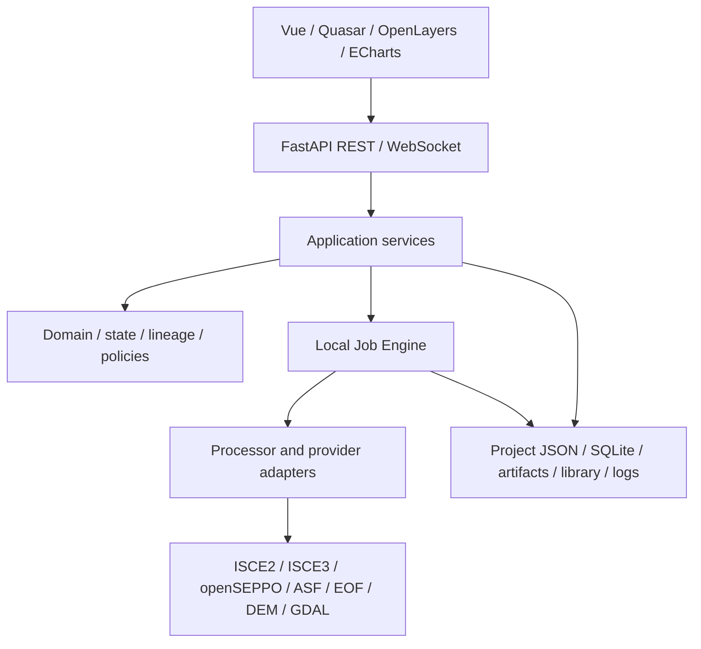

# Next-generation architecture

Status: accepted target specification, 2026-09-05. Implementation progress is tracked
in [migration](migration.md). This collection supersedes all legacy architecture
and Qt Workbench roadmaps. It does not claim that planned features are delivered.

InSAR-PILOT is a project-based SAR/InSAR workbench for discovery, preparation,
Sentinel-1/NISAR preprocessing, provenance, QC, products and GIS. Current scope is
Data Acquisition → Pre-processing → Products/QC. Time-series algorithms are reserved.

## Decisions

- Local single user on Ubuntu or WSL2 Ubuntu; loopback browser access.
- Vue 3, TypeScript, Quasar; OpenLayers/Proj4js; Apache ECharts.
- Python/FastAPI REST and WebSocket; SQLite; independent processor environments.
- Scientific workflows differ; Project/Pipeline/Run/Job/Artifact/QC infrastructure is shared.
- Isolated reruns take priority over unverified checkpoint reuse.
- Import legacy projects into a new project; preserve sources and unknown history.
- Structural QC failures block. Scientific metrics are advisory unless explicitly gated.
- Successful, valid results become active only if they still match current intent.
- No Qt dependency in the new engine, no Electron requirement, no distributed scheduler.

## Layers

Domain contains pure values and rules. Application services own use cases and
transactions. Infrastructure owns persistence, subprocesses and filesystem access.
Adapters preserve upstream numerical behavior. The browser never runs processing
or derives success from filenames or log output.

## Specification index

- [Current state and asset classification](current-state.md)
- [Domain relationships](domain-model.md), [Project](project-model.md)
- [Pipeline and freshness](pipeline-model.md), [Run and Job](run-job-model.md)
- [Artifact](artifact-model.md), [QC](qc-model.md), [Data](data-model.md)
- [Sentinel-1](sentinel1-pipeline.md), [NISAR](nisar-pipeline.md)
- [GUI and API](gui-architecture.md), [Storage](storage.md)
- [Migration and acceptance](migration.md)
