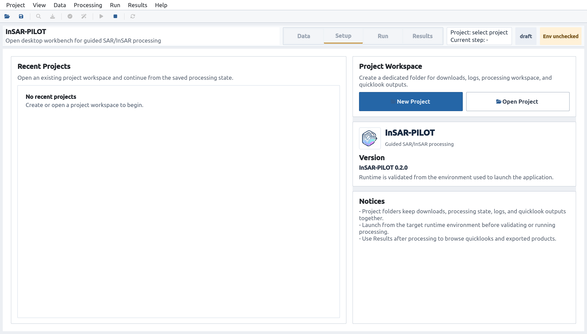
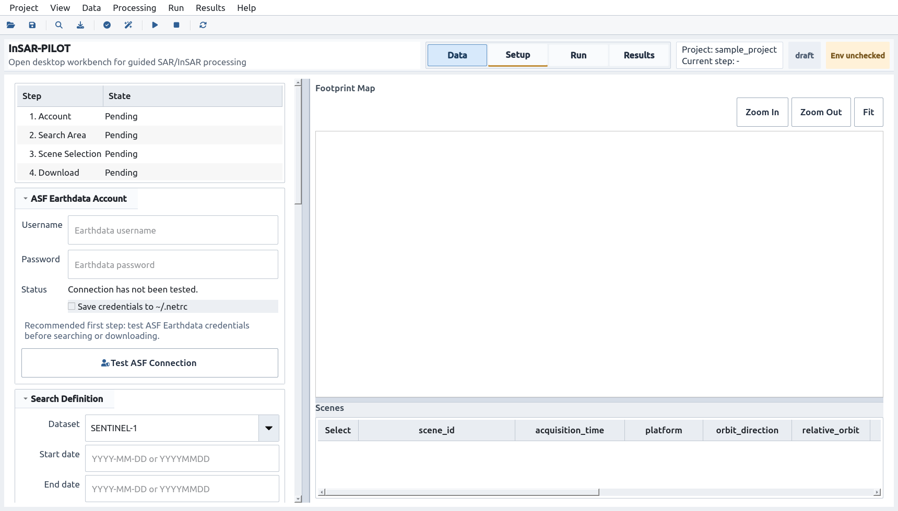
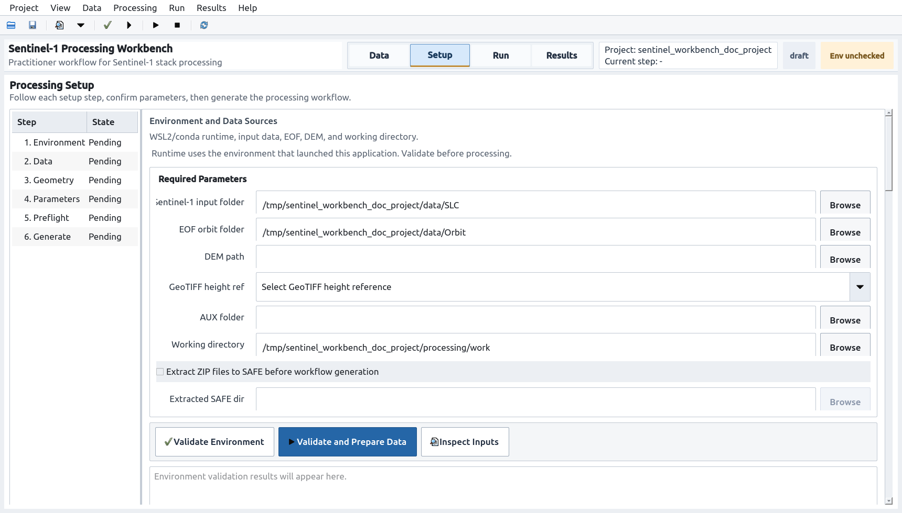
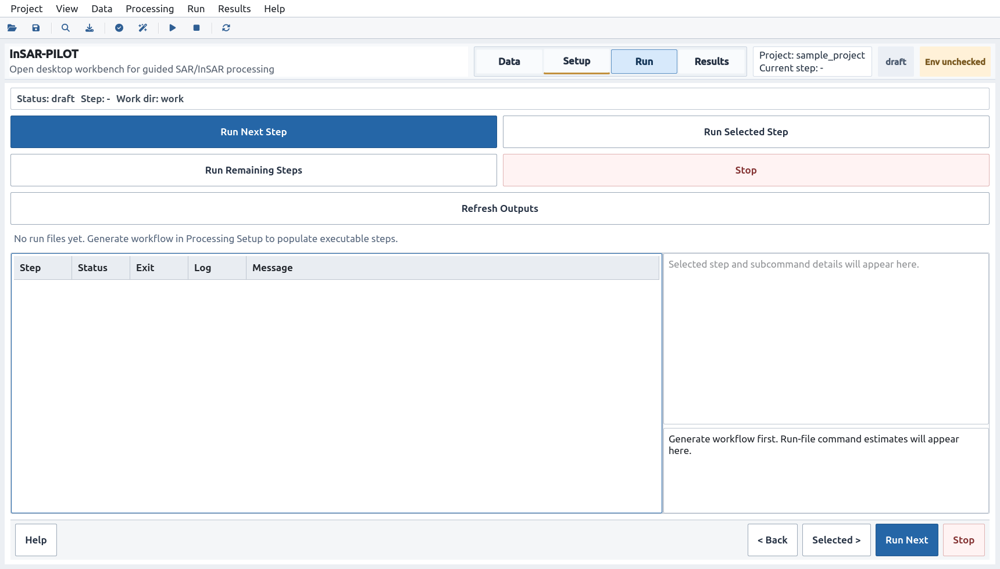
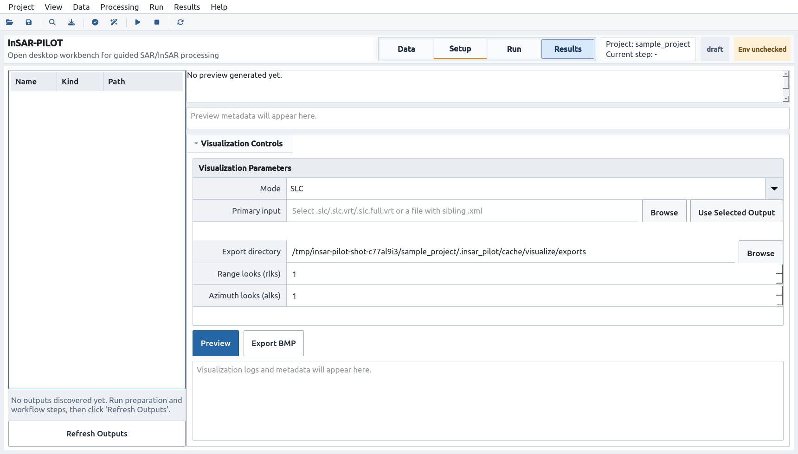

# InSAR-PILOT 用户手册

<p align="center">
  
</p>

[返回首页](../README.md) | [English Guide](USER_GUIDE_EN.md) | [故障排查](TROUBLESHOOTING.md)

## 1. 软件定位

**InSAR-PILOT** 是 **InSAR Processing Interface and Lightweight Orchestration Toolkit** 的缩写，中文可理解为“面向 InSAR 处理的轻量级图形界面与流程编排工具”。

它是一个面向 Ubuntu Desktop 和 WSL2/WSLg 的开源桌面处理工作台，以项目文件夹为单位，组织 SAR 数据下载、处理参数设置、官方处理链生成、run_files 执行监控和结果 quicklook 预览。

当前版本主要聚焦 Sentinel-1 与 ISCE2 官方处理流程。长期目标是逐步接入更多 SAR 载荷和时序 InSAR 处理能力，包括 SBAS、StaMPS 等流程。

v1.0.0 是首个正式发布版。建议先使用小范围样例项目验证运行环境、下载链路和处理结果，再进入正式生产流程。

## 2. 启动页与项目制



启动后先创建或打开项目。正式处理应始终绑定一个项目文件夹，便于保存数据、日志、状态和输出。

默认项目结构：

```text
project_root/
  project.pilot
  data/
    SLC/
    Orbit/
    DEM/
  processing/work/
  outputs/quicklooks/
  logs/
  .insar_pilot/cache/
```

`project.pilot` 保存 GUI 状态、下载参数、处理设置、执行状态和 quicklook 配置。该文件使用 InSAR-PILOT 专用后缀，内部仍是 JSON，便于审计和排查。旧版 `insar_pilot_project.json` 项目文件仍可加载。底层处理结果仍保存在处理工作目录中的标准输出文件夹内。

## 3. Data Acquisition



Data 页面负责 Sentinel-1 数据准备：

- 测试 Earthdata/ASF 账户。
- 输入日期、AOI、轨道方向、相对轨道号和极化方式。
- 查询 ASF Sentinel-1 SLC 场景。
- 在地图和表格中检查 footprint 与元数据。
- 选择场景并下载 SLC ZIP 和 EOF 轨道文件。
- 将下载目录导入到 Setup 的数据源字段。

建议先测试账户，再设置检索条件。搜索结果不会因为下载进度刷新而重置地图视图；日志只在用户停留底部时自动滚动。

## 4. Processing Setup



Setup 页面集中完成处理前配置：

- 检查当前启动环境中的 ISCE2/GDAL/snaphu/stack 工具。
- 选择或确认 Sentinel-1 输入目录、EOF 目录、DEM 路径和处理工作目录。
- 准备 ZIP/SAFE 输入清单。
- 设置 AOI/BBox、IW swaths、参考影像和极化参数。
- 配置 workflow、coregistration、looks、parallelism 等处理参数。
- 运行 Preflight，检查路径、权限、输入缺失、DEM/EOF、已有 run_files/configs 冲突。
- 预览并生成官方处理命令和 `run_files`。

主界面尽量展示操作人员需要的内容；完整路径、命令和诊断信息保留在 Technical Details 或日志中。

## 5. Run Executor



Run 页面用于执行和恢复处理：

- `Run Next Step` 执行下一个 pending/failed/cancelled step。
- `Run Selected Step` 重新执行选中的 step。
- `Run Remaining Steps` 连续执行剩余 step。
- `Stop` 请求停止当前执行。

每个 step 和 subcommand 会记录状态、日志路径、exit code 和错误信息。失败后建议先查看 subcommand log，再修正输入或环境，然后使用 selected/next 继续。

## 6. Results Quicklook



Results 页面只负责输出浏览和可视化：

- 扫描处理输出目录。
- 浏览发现的 SLC、interferogram、merged products 和 quicklook。
- 生成 SLC、干涉图或 overlay 预览。
- 导出 BMP quicklook。

该页面不承担流程状态管理；流程状态以项目文件、Run 页面和日志为准。

## 7. ISCE2 调用关系

InSAR-PILOT 当前的 Sentinel-1 处理能力建立在 [ISCE2](https://github.com/isce-framework/isce2) 及其官方 [stack processors / TOPS stack](https://github.com/isce-framework/isce2/blob/main/contrib/stack/README.md) 之上。ISCE2 是开源 InSAR 科学计算环境，InSAR-PILOT 通过桌面界面、项目制工作区和执行监控把它的 Sentinel-1 TOPS 工作流组织得更容易使用。

> 致谢与边界：InSAR-PILOT 不是 ISCE2 官方项目，不修改 ISCE2 算法，也不重新发布 ISCE2 的处理结果解释。本项目尊重并依赖 ISCE2 开源工作，目标是为用户提供更清晰的输入准备、命令生成、run_files 执行和日志检查界面。

GUI 负责：

- 收集并保存参数。
- 准备输入目录与 DEM。
- 构造官方 `stackSentinel.py` 命令。
- 解析生成的 `run_files/run_*`。
- 调用 shell 执行 run files。
- 展示日志、状态、exit code 和输出结果。

GUI 不修改 ISCE2 算法，不伪装处理结果，也不把 run_files 隐藏成黑盒。

## 8. 安装、启动与测试

安装：

```bash
conda env create -f environment.yml
conda activate insar
pip install .
insar-pilot
```

可选地图支持：

```bash
pip install '.[map]'
```

测试：

```bash
conda run -n insar env PYTHONPATH=src QT_QPA_PLATFORM=offscreen pytest -q
```
