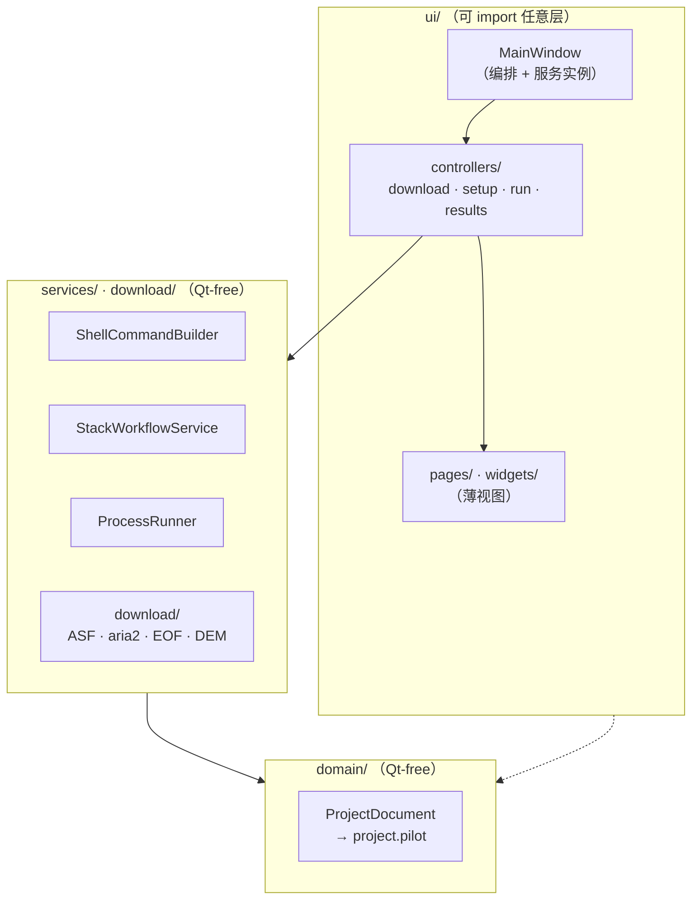

# 架构说明

面向贡献者。开发流程、环境搭建与 PR 约定见[贡献指南](https://github.com/WU-Pengzhan/InSAR-PILOT/blob/main/CONTRIBUTING.md)；本页只讲代码的分层结构与几条必须遵守的约定。

## 一句话定位

InSAR-PILOT 是一个 **PySide6 桌面工作台**，负责*编排* ISCE2 官方的 `topsStack` Sentinel-1 工作流，**不重新实现** SAR 处理。它帮操作者下载数据、准备输入（轨道/DEM/AOI）、生成规范的 `stackSentinel.py` 命令、执行产出的 `run_files/run_*`、预览结果。真正的数值计算发生在通过 bash shell 调用的 ISCE2 二进制程序里。

## 分层

代码严格分层，依赖方向单向：**ui → services/download → domain**。`services/` 和 `domain/` 必须保持 **Qt-free** 且可单测；只有 `ui/` 可以 import Qt。



- **`domain/project.py`** — 持久化状态的唯一真相源。`ProjectDocument` 是一棵 dataclass 树（`EnvironmentConfig`、`WorkflowConfig`、`DataDownloadConfig`、`ProjectState` → `RunStep` → `RunSubcommand` …），序列化为项目根下的 **`project.pilot`**（内部是 JSON）。标准项目布局（`data/SLC`、`data/Orbit`、`data/DEM`、`processing/work`、`outputs/quicklooks`、`logs`、`.insar_pilot/cache`）由 `ProjectWorkspace` 派生。
- **`services/`** — 每个关注点一个类的无状态业务逻辑：`shell.py`（执行骨干）、`stack_generator.py`（构造 `stackSentinel.py` 并同步 run 步骤）、`run_executor.py`（`ProcessRunner` 队列执行）、以及 `preflight.py`、`dem_preparer.py`、`runfile_plan.py`、`output_discovery.py` 等。
- **`download/`** — 自包含的 Sentinel-1 采集栈（ASF 检索、aria2c 下载 SLC、sentineleof 取 EOF、OpenTopography 取 DEM），网络行为集中在 `network.py`。
- **`ui/`** — `main_window.py` 是大编排器，持有所有服务实例；四个工作流页面是薄视图，实际逻辑拆到 `ui/controllers/`（见下）。
- **`launch.py`** — 运行时引导：在 import Qt 前修好 `LD_LIBRARY_PATH` / `QT_PLUGIN_PATH` / WebEngine 路径，并在子进程中探测 Qt 平台插件，为 WSL2/WSLg 与原生 Ubuntu 自动选择 `xcb`/`wayland`。

## 关键约定

### 1. 所有处理命令都走 ShellCommandBuilder

`services/shell.py` 的 `ShellCommandBuilder` 把每条命令包成：

```text
bash -lc "<conda 激活> && <ISCE 环境 export> && cd <cwd> && <命令>"
```

它同时支持 **source-tree** 与 **conda** 两种 ISCE2 布局——`resolve_isce_runtime_root` 依次探测 `ISCE_SRC`、`ISCE_ROOT`、`ISCE_HOME`、`CONDA_PREFIX`。**任何新的子进程处理工作都必须经由这个 builder，不要直接用 `subprocess`**，否则拿不到正确的 conda 激活与 ISCE2 环境。

### 2. QThread + worker 生命周期

绝不阻塞 GUI 线程。每个网络/阻塞操作都在 `QThread` + worker 上跑（`ui/download_worker.py`：`SearchWorker`、`DownloadWorker`、`CredentialWorker` 等）。固定生命周期：创建 thread+worker → `moveToThread` → 把 `finished`/`failed` 连到 `quit` → 在 `_clear_*_worker_refs` 槽里清空引用。新增异步工作请沿用此模式。

### 3. project.pilot 持久化与 from_dict 向后兼容

每个 dataclass 都有防御性的 `from_dict`：强制类型转换、容忍未知/遗留键。**新增持久化字段时，必须同时改对应 dataclass 及其 `from_dict`**（带类型强制），保持对旧 `project.pilot` 文件的兼容。若干遗留文件名仍可读取（见 `LEGACY_PROJECT_ROOT_FILE_NAMES`）。

### 4. ui/controllers 拆分

`MainWindow` 曾是巨型类，现按工作流域拆为四个控制器（`ui/controllers/`），行为与原先寄生在 `MainWindow` 上的代码一致：

- `download_controller.py` — 五条后台 QThread+worker 管线（SLC 下载、ASF 检索、Earthdata/Tianditu/OpenTopography 凭据测试）与数据下载页槽函数。
- `setup_controller.py` — 数据源/环境校验与准备、AOI/IW 选择、处理计划/workflow 生成三个子域。
- `run_controller.py` — 由 `ProcessRunner` 驱动的 `run_files` 执行，把状态流进 steps 树。
- `results_controller.py` — 输出发现、quicklook 预览渲染与可视化预览/导出。

每个控制器持有对 window 的引用以做少量 shell 级回调（错误对话框、状态刷新、跨域桥接）。

### 5. i18n

`i18n/translator.py` 从 `i18n/locales/*.json` 加载，英文回退。目前随包提供 `en.json` 与 `zh.json`。

### 6. 其他

- **GUI 永不在进程内跑 ISCE2**，全部通过 `ShellCommandBuilder` 外壳到激活的 `insar` 环境。
- **应用级偏好**（最近项目、语言、窗口布局）经 `app/settings.py` 存于 `QSettings`，与每项目状态 `project.pilot` 分离。

## 在这里高效工作

- 可测逻辑放 `services/`/`download/`（Qt-free、`tmp_path`-友好），`ui/` 保持薄。新纯逻辑应配一个无需显示即可跑的 `tests/test_*.py`。
- `run_executor.py` 是唯一因 `QObject`/`QProcess` 而必须与 Qt 耦合的“service”。
