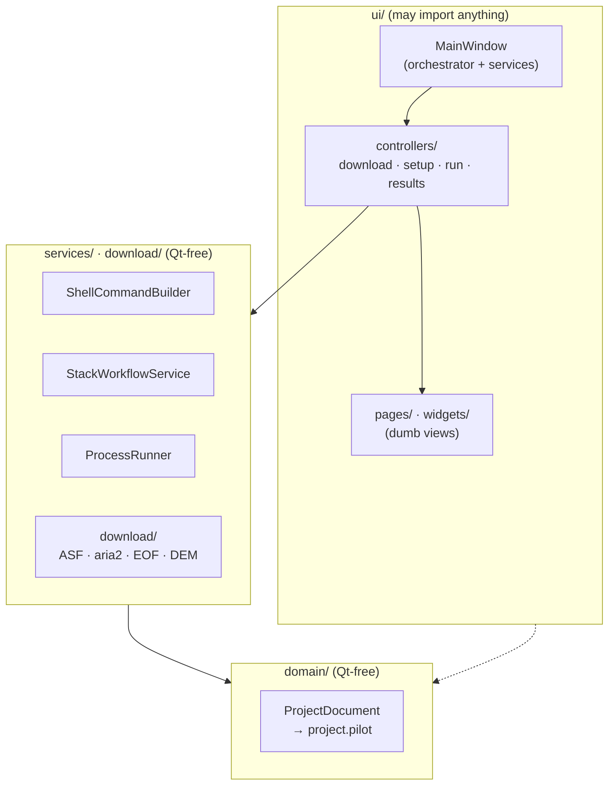

# Architecture

For contributors. Development setup, environment, and PR conventions live in the [Contributing guide](https://github.com/WU-Pengzhan/InSAR-PILOT/blob/main/CONTRIBUTING.md); this page covers the code's layering and a few binding conventions.

## What it is

InSAR-PILOT is a **PySide6 desktop workbench** that *orchestrates* the official ISCE2 `topsStack` Sentinel-1 workflow. It **does not reimplement** SAR processing. It helps an operator download data, prepare inputs (orbits/DEM/AOI), generate the canonical `stackSentinel.py` command, execute the resulting `run_files/run_*`, and preview outputs. The real numerical work happens inside ISCE2 binaries invoked through a bash shell.

## Layering

The codebase is strictly layered with a single dependency direction: **ui → services/download → domain**. `services/` and `domain/` must stay **Qt-free** and unit-testable; only `ui/` may import Qt.



- **`domain/project.py`** — the single source of truth for persisted state. `ProjectDocument` is a tree of dataclasses (`EnvironmentConfig`, `WorkflowConfig`, `DataDownloadConfig`, `ProjectState` → `RunStep` → `RunSubcommand`, …) serialized to a **`project.pilot`** file (JSON inside). The standard project layout (`data/SLC`, `data/Orbit`, `data/DEM`, `processing/work`, `outputs/quicklooks`, `logs`, `.insar_pilot/cache`) is derived via `ProjectWorkspace`.
- **`services/`** — stateless business logic, one class per concern: `shell.py` (the execution backbone), `stack_generator.py` (builds `stackSentinel.py` and syncs run steps), `run_executor.py` (`ProcessRunner` queue), plus `preflight.py`, `dem_preparer.py`, `runfile_plan.py`, `output_discovery.py`, and others.
- **`download/`** — a self-contained Sentinel-1 acquisition stack (ASF search, aria2c SLC download, sentineleof EOF orbits, OpenTopography DEM); network behavior is centralized in `network.py`.
- **`ui/`** — `main_window.py` is a large orchestrator owning every service instance; the four workflow pages are dumb views, with logic split into `ui/controllers/` (below).
- **`launch.py`** — runtime bootstrapping: before importing Qt it fixes `LD_LIBRARY_PATH` / `QT_PLUGIN_PATH` / WebEngine paths, then probes Qt platform plugins in a child process to auto-select `xcb`/`wayland` for WSL2/WSLg vs. native Ubuntu.

## Key conventions

### 1. All processing commands go through ShellCommandBuilder

`ShellCommandBuilder` (`services/shell.py`) wraps every command as:

```text
bash -lc "<conda activation> && <ISCE env exports> && cd <cwd> && <command>"
```

It supports both **source-tree** and **conda** ISCE2 layouts — `resolve_isce_runtime_root` probes `ISCE_SRC`, `ISCE_ROOT`, `ISCE_HOME`, `CONDA_PREFIX`. **Any new subprocess processing work must go through this builder, not bare `subprocess`**, so it inherits the correct conda activation and ISCE2 environment.

### 2. QThread + worker lifecycle

Never block the GUI thread. Every network/blocking operation runs on a `QThread` + worker (`ui/download_worker.py`: `SearchWorker`, `DownloadWorker`, `CredentialWorker`, …). The repeated lifecycle: create thread+worker → `moveToThread` → connect `finished`/`failed` to `quit` → null out refs in a `_clear_*_worker_refs` slot. Mirror this for new async work.

### 3. project.pilot persistence and from_dict backward compat

Every dataclass has a defensive `from_dict` that coerces types and tolerates unknown/legacy keys. **When adding a persisted field, add it to the relevant dataclass AND its `from_dict`** (with type coercion), preserving compatibility with older `project.pilot` files. Several legacy filenames are still read (see `LEGACY_PROJECT_ROOT_FILE_NAMES`).

### 4. ui/controllers split

`MainWindow` was once a monolith; it is now split by workflow domain into four controllers (`ui/controllers/`), with behavior identical to the code that previously lived on `MainWindow`:

- `download_controller.py` — five background QThread+worker pipelines (SLC download, ASF search, Earthdata/Tianditu/OpenTopography credential tests) and the data-download page slots.
- `setup_controller.py` — data sources / environment validation and preparation, AOI/IW selection, and the processing plan / workflow generation.
- `run_controller.py` — `ProcessRunner`-driven execution of `run_files`, streaming state into the steps tree.
- `results_controller.py` — output discovery, quicklook preview rendering, and visualization preview/export.

Each controller keeps a reference to the window for a handful of shell-level callbacks (error dialogs, status refresh, cross-domain bridges).

### 5. i18n

`i18n/translator.py` loads `i18n/locales/*.json` with English fallback. `en.json` and `zh.json` currently ship.

### 6. Other

- **The GUI never runs ISCE2 in-process** — all heavy work is shelled through `ShellCommandBuilder` into the activated `insar` env.
- **App-level preferences** (recent projects, language, window layout) live in `QSettings` via `app/settings.py`, separate from per-project `project.pilot` state.

## Working effectively

- Put testable logic in `services/`/`download/` (Qt-free, `tmp_path`-friendly) and keep `ui/` thin. New pure logic should come with a `tests/test_*.py` that runs without a display.
- `run_executor.py` is the one "service" that is Qt-coupled by necessity (`QObject`/`QProcess`).
