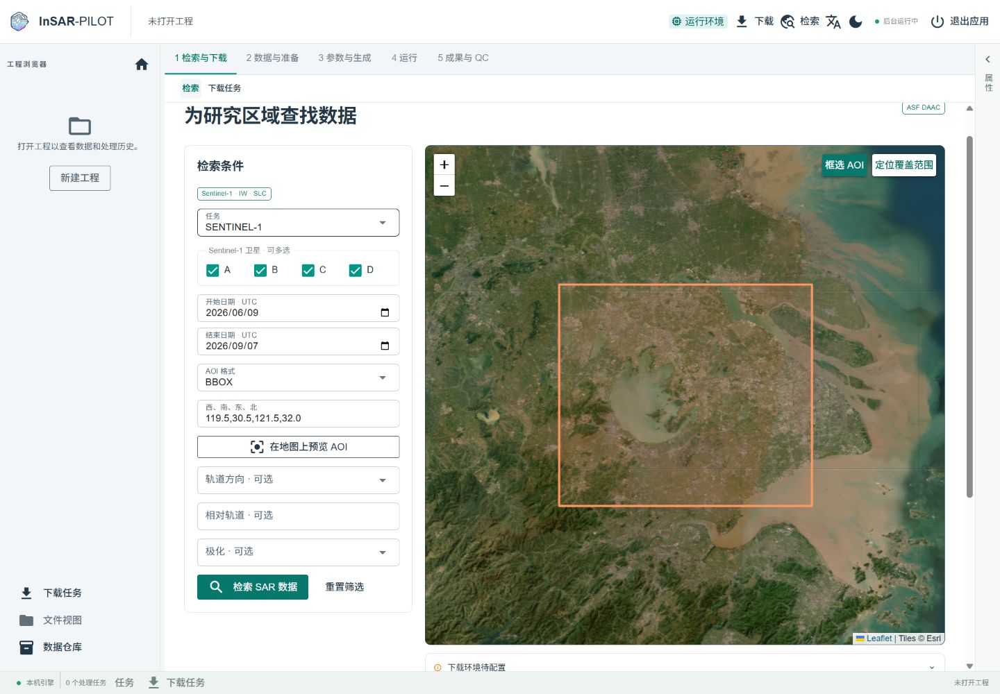

# 让雷达影像工作，更有条理

InSAR-PILOT 是本机运行、浏览器使用的 SAR/InSAR 工作台。1.5.0 聚焦 Sentinel-1 的工程管理、地图检索与下载体验。

## 开始探索

- [安装 1.5.0](installation.md) · [快速开始](quickstart.md)
- [工作台指南](user-guide.md) · [故障排查](troubleshooting.md)
- [版本说明](releases/1.5.0.md) · [English](en/index.md)

## 开发与进度

- [当前架构](architecture/overview.md) · [实施状态](architecture/migration.md)
- [交接索引](handoff/index.md) · [发行维护](releases/maintenance.md)

P02—P05 完整专业页面仍待逐页完善；当前界面入口不代表完整科学流程已验收。
