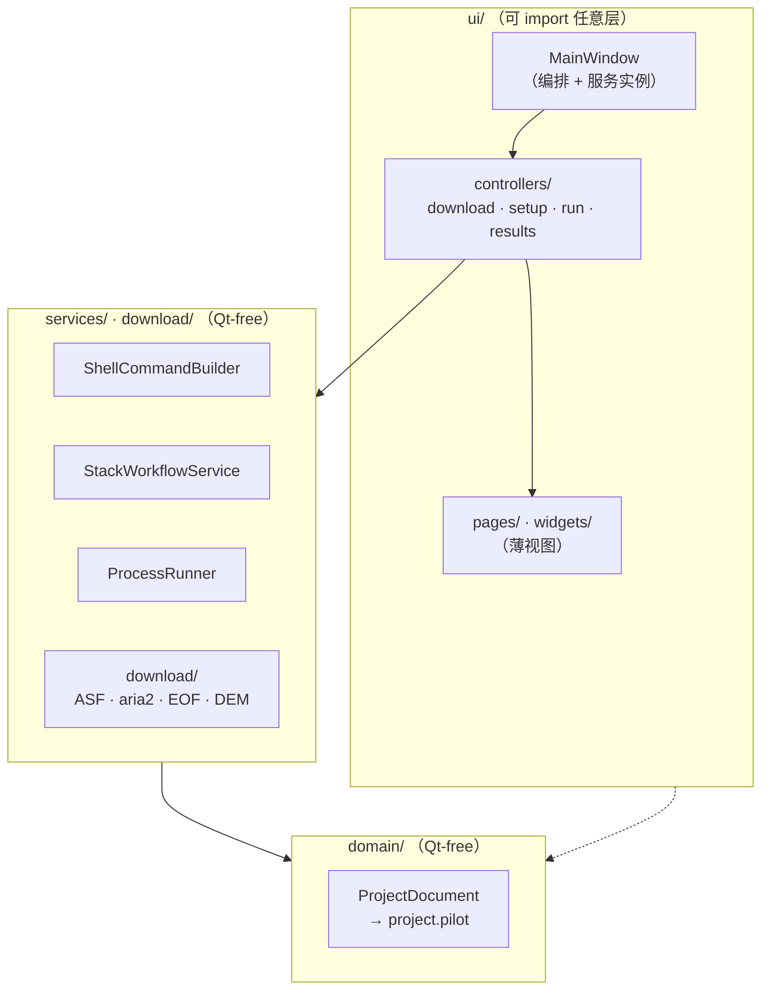

> LEGACY / HISTORICAL EVIDENCE. Not an active architecture specification.

# 架构说明

面向贡献者。开发流程、环境搭建与 PR 约定见[贡献指南](https://github.com/WU-Pengzhan/InSAR-PILOT/blob/main/CONTRIBUTING.md)；本页描述当前 v1.2.0 代码的真实分层和约定。下一代 GUI、统一检索框架及 mission 范围见[重构路线](refactoring-roadmap.md)，不要把目标能力误写成当前已实现能力。

## 一句话定位

InSAR-PILOT 是一个 **PySide6 桌面工作台**，负责*编排* ISCE2 官方的 `topsStack` Sentinel-1 工作流，**不重新实现** SAR 处理。它帮操作者下载数据、准备输入（轨道/DEM/AOI）、生成规范的 `stackSentinel.py` 命令、执行产出的 `run_files/run_*`、预览结果。真正的数值计算发生在通过 bash shell 调用的 ISCE2 二进制程序里。

## 分层

代码严格分层，依赖方向单向：**ui → services/download → domain**。`services/` 和 `domain/` 必须保持 **Qt-free** 且可单测；只有 `ui/` 可以 import Qt。



- **`domain/project.py`** — 持久化状态的唯一真相源。`ProjectDocument` 是一棵 dataclass 树（`EnvironmentConfig`、`WorkflowConfig`、`DataDownloadConfig`、`ProjectState` → `RunStep` → `RunSubcommand` …），序列化为项目根下的 **`project.pilot`**（内部是 JSON）。标准项目布局（`data/SLC`、`data/Orbit`、`data/DEM`、`processing/work`、`outputs/quicklooks`、`logs`、`.insar_pilot/cache`）由 `ProjectWorkspace` 派生。
- **`services/`** — 每个关注点一个类的无状态业务逻辑：`shell.py`（执行骨干）、`stack_generator.py`（构造 `stackSentinel.py` 并同步 run 步骤）、`run_executor.py`（`ProcessRunner` 队列执行）、以及 `preflight.py`、`dem_preparer.py`、`runfile_plan.py`、`output_discovery.py` 等。
- **`download/`** — 自包含的采集栈（ASF 检索、aria2c 下载 SLC、sentineleof 取 EOF、DEM Provider 路由），网络行为集中在 `network.py`。COP30 默认从 AWS Open Data 的 1° COG 瓦片以 8 路可续传 Range 下载，缓存后由 GDAL 按 AOI 裁剪/拼接；AW3D30_E 仍由 OpenTopography 提供。
- **`ui/`** — `main_window.py` 是大编排器，持有所有服务实例；四个工作流页面是薄视图，实际逻辑拆到 `ui/controllers/`（见下）。
- **`launch.py`** — 运行时引导：在 import Qt 前修好 `LD_LIBRARY_PATH` / `QT_PLUGIN_PATH` / WebEngine 路径，并在子进程中探测 Qt 平台插件，为 WSL2/WSLg 与原生 Ubuntu 自动选择 `xcb`/`wayland`。

### 下一代 Workbench 检索边界

新 Workbench 仍通过 `INSAR_PILOT_WORKBENCH=1` 显式启用，不替换旧 `MainWindow`。其检索依赖方向为：

```text
SearchWorkspace（空控件 + 渲染）
→ SearchPresenter / SearchCapabilityViewModel
→ SearchApplicationService
→ Provider Registry
→ SARSearchProvider
```

`ProviderDescriptor.search_capabilities` 是 mission、产品类型、平台、筛选项和分页限制的唯一生产来源。GUI 只读取不可变 descriptor，不调用 provider；实际 `supports/search` 在 Workbench 自有后台线程池执行。当前生产 Registry 只登记 ASF Sentinel-1，NISAR RSLC 和 ALOS search-only 仅作为下一阶段 provider adapter 的契约与 fake-provider 测试存在。

Provider 的 SEARCH/DOWNLOAD 能力与处理 Backend 分离。旧 Sentinel-1 + ISCE2 可处理性不会声明成搜索 provider 的 PROCESSING capability；搜索、选择和状态变化也不会触发可视化。

### Sentinel-1 / NISAR 数据整合边界（后端已实现，UI 待接入）

以下依赖方向中的 Reader、Canonical model、Catalog、Compatibility 和 Workflow Eligibility
已经落地；Workbench Data Workspace 与处理 Runtime 尚未接入：

```text
Workbench Data Workspace
→ Local Import Application Service
→ Local Product Reader Registry
   ├── Sentinel1SafeReader（ZIP/SAFE）
   └── NisarRslcReader（HDF5 RSLC）
→ LocalSARProduct / AssetRef
→ Project Data Catalog
→ Compatibility / Workflow Eligibility
```

统一发生在逻辑产品、资产引用、Catalog、任务状态和 GUI 外壳。Sentinel TOPS 与 NISAR 的 Reader、兼容性规则、参数模型和 Processing Recipe 保持独立。普通文件路径和 HDF5 内部 dataset 必须由同一 `AssetRef` 类契约表达；不得把 h5py、zipfile 或 provider SDK 对象传入 GUI。

Data Catalog 的“同时管理”不允许 Sentinel-1 与 NISAR 组成跨 mission 干涉对。现有 `WorkflowConfig` 和 `StackWorkflowService` 仍是 Sentinel-1 + ISCE2 专用实现；NISAR 参数不得继续堆入该 dataclass，也不得通过 GUI 控件的 mission 字符串分支直接拼接 ISCE3 命令。

详细范围、里程碑验收和顺序化开发 prompts 见[Sentinel-1 / NISAR 数据整合里程碑](sentinel-nisar-data-integration.md)。

### 唯一官方处理路径

处理层按 mission 共用 Task Runtime，不共用 SAR 算法：Sentinel-1 IW SLC 的唯一入口是
ISCE2 `stackSentinel.py -W interferogram`，其 `run_files/run_*` 是阶段定义的唯一真源；
NISAR RSLC 的唯一入口是 ISCE3 `nisar.workflows.insar` runconfig workflow。Recipe Registry
拒绝同一 mission/product type 的第二条处理 recipe。

Sentinel 的标准策略固定为“逐 burst 生成干涉图，再 merge burst interferogram”。官方流程
虽然会先生成 merged reference/coregistered SLC 产品，但这些 merged SLC 不作为直接生成最终
IFG 的替代输入；真实数据证明该替代算法在 burst seam 处不等价。应用不得在运行前静默修改
ISCE2 生成的 merge config。完整决策、数值证据和模块边界见
[官方处理路径与模块边界](official-processing-paths.md)。

## 关键约定

### 1. 处理命令使用受控 Runtime

Legacy GUI 中，`services/shell.py` 的 `ShellCommandBuilder` 把命令包成：

```text
bash -lc "<conda 激活> && <ISCE 环境 export> && cd <cwd> && <命令>"
```

它同时支持 **source-tree** 与 **conda** 两种 ISCE2 布局。统一 Task Runtime 的 Backend 则从
显式 `RuntimeProfile` 获取可审计的解释器/环境，并以固定 argv 或官方生成的 run file 启动
子进程。业务服务和 GUI 不得自行拼接第三条执行路径。

### 2. QThread + worker 生命周期

绝不阻塞 GUI 线程。每个网络/阻塞操作都在 `QThread` + worker 上跑（`ui/download_worker.py`：`SearchWorker`、`DownloadWorker`、`CredentialWorker` 等）。固定生命周期：创建 thread+worker → `moveToThread` → 把 `finished`/`failed` 连到 `quit` → 在 `_clear_*_worker_refs` 槽里清空引用。新增异步工作请沿用此模式。

### 3. project.pilot 持久化与 from_dict 向后兼容

每个 dataclass 都有防御性的 `from_dict`：强制类型转换、容忍未知/遗留键。**新增持久化字段时，必须同时改对应 dataclass 及其 `from_dict`**（带类型强制），保持对旧 `project.pilot` 文件的兼容。若干遗留文件名仍可读取（见 `LEGACY_PROJECT_ROOT_FILE_NAMES`）。

### 4. ui/controllers 拆分

`MainWindow` 曾是巨型类，现按工作流域拆为四个控制器（`ui/controllers/`），行为与原先寄生在 `MainWindow` 上的代码一致：

- `download_controller.py` — 五条后台 QThread+worker 管线（SLC 下载、ASF 检索、Earthdata/Tianditu/OpenTopography 凭据测试）与数据下载页槽函数。
- `setup_controller.py` — 数据源/环境校验与准备、AOI/IW 选择、处理计划/workflow 生成三个子域。
- `run_controller.py` — 由 `ProcessRunner` 驱动的 `run_files` 执行，把状态流进 steps 树。
- `result_catalog.py` — 将 merged SLC/INT/相干系数/解缠结果及其 sidecar 归并为稳定的逻辑产品。
- `results_controller.py` — 产品选择、参考 SLC 自动匹配、全分辨率预览与 PNG/BMP/JSON 导出。

### DEM 下载边界

`DemDownloadService` 只负责按 `source_id` 路由，不把来源差异带入 GUI 或 Task。`COP30` 使用无需密钥的 `Cop30AwsDemService`，缓存目录为下载工作区的 `DEM/cache/cop30/`；`AW3D30_E` 继续使用带 API key 的 `OpenTopographyDemService`。两条路径最终都产生按计划 bbox 裁剪的 GeoTIFF，并保留原有高程基准字段。

本机 ISCE2 `applications/dem.py` 只支持 SRTM v2/v3 与 NASADEM，不是 COP30 Provider。NISAR `workflows/stage_dem.py` 是面向 RSLC 的处理前 staging 工具，依赖 AWS `nisar-dem` 凭据；它可以作为未来 NISAR Recipe 的专用步骤，但不替代统一 DEM 采集层。CDSE Sentinel Hub Process API 可生成 `COPERNICUS_30` 子集，但需要独立 OAuth 凭据，接入前必须完成国内直连吞吐与配额测试。

每个控制器持有对 window 的引用以做少量 shell 级回调（错误对话框、状态刷新、跨域桥接）。

### 5. i18n

`i18n/translator.py` 从 `i18n/locales/*.json` 加载，英文回退。目前随包提供 `en.json` 与 `zh.json`。

### 6. 其他

- **GUI 永不在进程内跑 ISCE2**，全部通过 `ShellCommandBuilder` 外壳到激活的 `insar` 环境。
- **应用级偏好**（最近项目、语言、窗口布局）经 `app/settings.py` 存于 `QSettings`，与每项目状态 `project.pilot` 分离。

## 在这里高效工作

- 可测逻辑放 `services/`/`download/`（Qt-free、`tmp_path`-友好），`ui/` 保持薄。新纯逻辑应配一个无需显示即可跑的 `tests/test_*.py`。
- `run_executor.py` 是唯一因 `QObject`/`QProcess` 而必须与 Qt 耦合的“service”。
