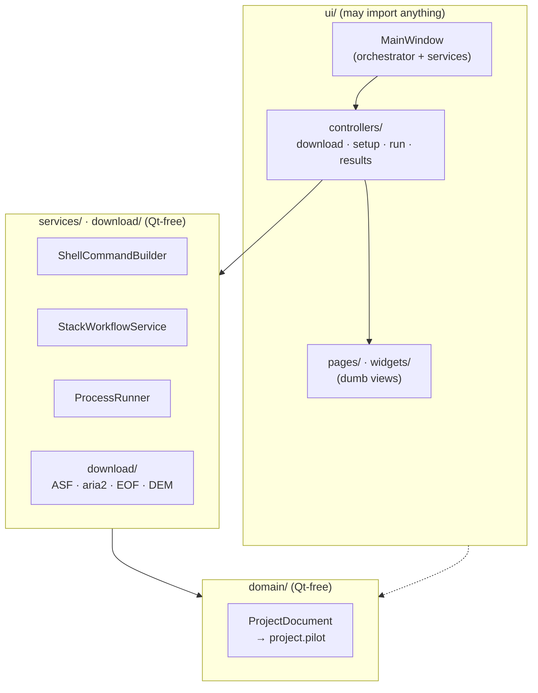

> LEGACY / HISTORICAL EVIDENCE. Not an active architecture specification.

# Architecture

For contributors. Development setup, environment, and PR conventions live in the [Contributing guide](https://github.com/WU-Pengzhan/InSAR-PILOT/blob/main/CONTRIBUTING.md). This page documents the current v1.2.0 layering and conventions. See the [refactoring roadmap](refactoring-roadmap.md) for the next-generation GUI, unified search framework, and mission scope; target capabilities must not be presented as already implemented.

## What it is

InSAR-PILOT is a **PySide6 desktop workbench** that *orchestrates* the official ISCE2 `topsStack` Sentinel-1 workflow. It **does not reimplement** SAR processing. It helps an operator download data, prepare inputs (orbits/DEM/AOI), generate the canonical `stackSentinel.py` command, execute the resulting `run_files/run_*`, and preview outputs. The real numerical work happens inside ISCE2 binaries invoked through a bash shell.

## Layering

The codebase is strictly layered with a single dependency direction: **ui → services/download → domain**. `services/` and `domain/` must stay **Qt-free** and unit-testable; only `ui/` may import Qt.



- **`domain/project.py`** — the single source of truth for persisted state. `ProjectDocument` is a tree of dataclasses (`EnvironmentConfig`, `WorkflowConfig`, `DataDownloadConfig`, `ProjectState` → `RunStep` → `RunSubcommand`, …) serialized to a **`project.pilot`** file (JSON inside). The standard project layout (`data/SLC`, `data/Orbit`, `data/DEM`, `processing/work`, `outputs/quicklooks`, `logs`, `.insar_pilot/cache`) is derived via `ProjectWorkspace`.
- **`services/`** — stateless business logic, one class per concern: `shell.py` (the execution backbone), `stack_generator.py` (builds `stackSentinel.py` and syncs run steps), `run_executor.py` (`ProcessRunner` queue), plus `preflight.py`, `dem_preparer.py`, `runfile_plan.py`, `output_discovery.py`, and others.
- **`download/`** — a self-contained acquisition stack (ASF search, aria2c SLC downloads, sentineleof EOF orbits, and DEM provider routing); network behavior is centralized in `network.py`. COP30 defaults to eight resumable ranges against one-degree AWS Open Data COG tiles, caches the source tiles, then uses GDAL to crop/mosaic the AOI. AW3D30_E remains on OpenTopography.
- **`ui/`** — `main_window.py` is a large orchestrator owning every service instance; the four workflow pages are dumb views, with logic split into `ui/controllers/` (below).
- **`launch.py`** — runtime bootstrapping: before importing Qt it fixes `LD_LIBRARY_PATH` / `QT_PLUGIN_PATH` / WebEngine paths, then probes Qt platform plugins in a child process to auto-select `xcb`/`wayland` for WSL2/WSLg vs. native Ubuntu.

### Next-generation Workbench search boundary

The new Workbench remains opt-in through `INSAR_PILOT_WORKBENCH=1` and does not replace the legacy `MainWindow`. Its search dependency direction is:

```text
SearchWorkspace (empty controls + rendering)
→ SearchPresenter / SearchCapabilityViewModel
→ SearchApplicationService
→ Provider Registry
→ SARSearchProvider
```

`ProviderDescriptor.search_capabilities` is the only production source for missions, product types, platforms, filters, and pagination limits. The GUI reads immutable descriptors and never invokes providers; actual `supports/search` calls run in the Workbench-owned background pool. The production registry currently contains only ASF Sentinel-1. NISAR RSLC and ALOS search-only remain contracts exercised by fake-provider tests until their adapters are implemented separately.

Provider SEARCH/DOWNLOAD capabilities remain separate from processing backends. The legacy Sentinel-1 + ISCE2 path is not represented as a search-provider PROCESSING capability, and search, selection, or state changes never launch visualization.

### Planned Sentinel-1 / NISAR data-integration boundary

The active milestone targets the following dependency direction; this is not a statement of currently delivered behavior:

```text
Workbench Data Workspace
→ Local Import Application Service
→ Local Product Reader Registry
   ├── Sentinel1SafeReader (ZIP/SAFE)
   └── NisarRslcReader (HDF5 RSLC)
→ LocalSARProduct / AssetRef
→ Project Data Catalog
→ Compatibility / Workflow Eligibility
```

Logical products, asset references, Catalog state, task status, and the Workbench shell are shared. Readers, compatibility rules, parameter models, and processing recipes remain mission-specific. One asset contract must represent both ordinary files and HDF5 subdatasets, and native h5py/zip/provider objects must never enter the GUI.

A shared Catalog does not permit Sentinel-1 and NISAR to form a cross-mission interferometric pair. The current `WorkflowConfig` and `StackWorkflowService` remain Sentinel-1 + ISCE2-specific; NISAR parameters must not be appended to that dataclass or translated into ISCE3 commands by widget string branches. See the [milestone guide](../sentinel-nisar-data-integration.md) for detailed scope and prompts.

### One official processing path per mission

Sentinel-1 IW SLC uses only the official ISCE2 `stackSentinel.py -W interferogram`
route, with generated `run_files/run_*` as the stage source of truth. NISAR RSLC uses
only an ISCE3 `nisar.workflows.insar` runconfig. The shared layer owns task state,
dependencies, retry, logs, overwrite policy, and product registration—not SAR algorithms.

The Sentinel strategy is explicitly burst-IFG-then-merge. Although topsStack creates
merged reference/coregistered SLC products before interferogram formation, directly
cross-multiplying those merged SLCs is not an equivalent production route at burst seams.
The application must not silently rewrite generated ISCE2 merge configs.

## Key conventions

### 1. Processing commands use a controlled runtime

In the legacy GUI, `ShellCommandBuilder` (`services/shell.py`) wraps commands as:

```text
bash -lc "<conda activation> && <ISCE env exports> && cd <cwd> && <command>"
```

It supports both **source-tree** and **conda** ISCE2 layouts. Unified Task Runtime
backends instead receive an explicit, auditable `RuntimeProfile` and launch fixed argv or
officially generated run files. Business services and GUI code must not create a third
execution route.

### 2. QThread + worker lifecycle

Never block the GUI thread. Every network/blocking operation runs on a `QThread` + worker (`ui/download_worker.py`: `SearchWorker`, `DownloadWorker`, `CredentialWorker`, …). The repeated lifecycle: create thread+worker → `moveToThread` → connect `finished`/`failed` to `quit` → null out refs in a `_clear_*_worker_refs` slot. Mirror this for new async work.

### 3. project.pilot persistence and from_dict backward compat

Every dataclass has a defensive `from_dict` that coerces types and tolerates unknown/legacy keys. **When adding a persisted field, add it to the relevant dataclass AND its `from_dict`** (with type coercion), preserving compatibility with older `project.pilot` files. Several legacy filenames are still read (see `LEGACY_PROJECT_ROOT_FILE_NAMES`).

### 4. ui/controllers split

`MainWindow` was once a monolith; it is now split by workflow domain into four controllers (`ui/controllers/`), with behavior identical to the code that previously lived on `MainWindow`:

- `download_controller.py` — five background QThread+worker pipelines (SLC download, ASF search, Earthdata/Tianditu/OpenTopography credential tests) and the data-download page slots.
- `setup_controller.py` — data sources / environment validation and preparation, AOI/IW selection, and the processing plan / workflow generation.
- `run_controller.py` — `ProcessRunner`-driven execution of `run_files`, streaming state into the steps tree.
- `result_catalog.py` — collapses merged SLC/INT/coherence/unwrapped outputs and their sidecars into stable logical products.
- `results_controller.py` — product selection, reference-SLC matching, full-resolution preview, and PNG/BMP/JSON export.

### DEM acquisition boundary

`DemDownloadService` routes on `source_id` without leaking source differences into the GUI or Task model. `COP30` uses the credential-free `Cop30AwsDemService` and caches source tiles under `DEM/cache/cop30/`; `AW3D30_E` continues to use the API-key-backed `OpenTopographyDemService`. Both paths produce a bbox-cropped GeoTIFF and preserve the existing height-reference field.

The installed ISCE2 `applications/dem.py` supports SRTM v2/v3 and NASADEM, not COP30. NISAR `workflows/stage_dem.py` is an RSLC-specific processing-stage utility requiring AWS `nisar-dem` credentials; it may become a NISAR Recipe step but does not replace the common acquisition layer. The CDSE Sentinel Hub Process API can produce `COPERNICUS_30` subsets, but requires separate OAuth credentials and must pass direct-China throughput and quota tests before becoming a default provider.

Each controller keeps a reference to the window for a handful of shell-level callbacks (error dialogs, status refresh, cross-domain bridges).

### 5. i18n

`i18n/translator.py` loads `i18n/locales/*.json` with English fallback. `en.json` and `zh.json` currently ship.

### 6. Other

- **The GUI never runs ISCE2 in-process** — all heavy work is shelled through `ShellCommandBuilder` into the activated `insar` env.
- **App-level preferences** (recent projects, language, window layout) live in `QSettings` via `app/settings.py`, separate from per-project `project.pilot` state.

## Working effectively

- Put testable logic in `services/`/`download/` (Qt-free, `tmp_path`-friendly) and keep `ui/` thin. New pure logic should come with a `tests/test_*.py` that runs without a display.
- `run_executor.py` is the one "service" that is Qt-coupled by necessity (`QObject`/`QProcess`).
